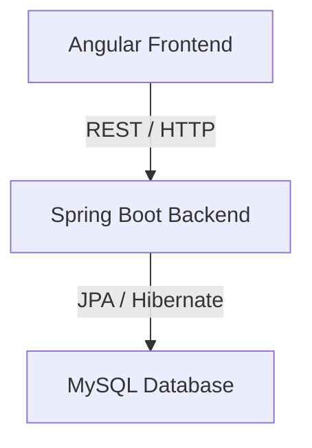
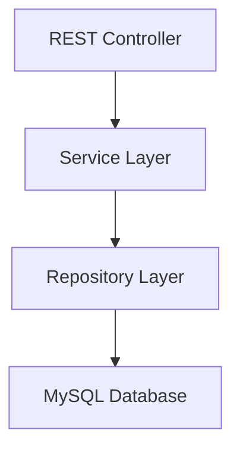
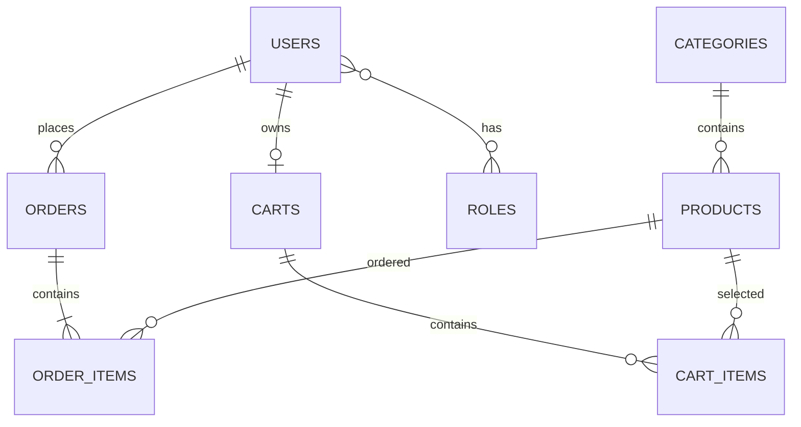
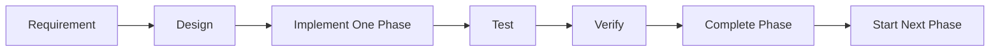

# E-Commerce POC — Master Requirements and Implementation Guide

## 1. Role

This POC involves two primary application roles.

| Role | Responsibilities |
|---|---|
| **Customer** | Register, log in, browse products, search products, view product details, manage shopping cart, checkout, place orders, and view order history |
| **Admin** | Log in, manage products and categories, deactivate products, view customer orders, and update order status |

### Customer

A customer can:
- Create an account
- Log in securely
- Browse available products
- Search for products
- View product details
- Add products to a shopping cart
- Change cart quantities
- Remove products from the cart
- Proceed to checkout
- Place an order
- View previous orders

### Admin

An administrator can:
- Log in securely
- Create products
- Update products
- Deactivate products
- Manage product categories
- View customer orders
- Update order status

---

# 2. Goal

## 2.1 Primary Goal

Build a simple end-to-end e-commerce application demonstrating how a Senior Java Developer designs and develops a complete application.

The application demonstrates:

- Java/Spring Boot backend development
- Angular frontend development
- REST API design
- MySQL database integration
- Authentication and authorization
- Product management
- Product browsing
- Product search
- Shopping cart management
- Checkout
- Order placement
- Customer order history
- Basic admin order management
- Validation
- Error handling
- Logging
- Unit testing
- Integration testing
- Clean and maintainable design

## 2.2 POC Scope

The first version consists of:

```text
Angular Frontend
       |
       | REST / HTTP
       v
Spring Boot Backend
       |
       | JPA / Hibernate
       v
Local MySQL Database
```

The frontend and backend are separate applications.

## 2.3 What This POC Is NOT Trying to Solve

The initial POC intentionally avoids unnecessary enterprise infrastructure:

- Microservices
- Kubernetes
- OpenShift
- Kafka
- Redis
- Elasticsearch
- Cloud deployment
- API Gateway
- Distributed tracing
- Complex event-driven architecture
- Payment gateway integration
- Recommendation engines
- Multiple warehouse management
- Advanced inventory management
- Complex coupon engines
- Production-scale observability platforms

These can be considered later as advanced enhancements.

## 2.4 Design Philosophy

> **Simple architecture first, extensibility second, unnecessary complexity never.**

---

# 3. Technology Stack

## 3.1 Backend

| Technology | Purpose |
|---|---|
| Java 21+ | Backend programming language |
| Spring Boot 3+ | Application framework |
| Spring Web | REST API development |
| Spring Data JPA | Persistence abstraction |
| Hibernate | ORM implementation |
| Spring Security | Authentication and authorization |
| Maven | Build and dependency management |
| JUnit 5 | Unit testing |
| Mockito | Mocking dependencies |

## 3.2 Database

- Local MySQL
- JPA/Hibernate for persistence

## 3.3 Frontend

| Technology | Purpose |
|---|---|
| Angular | Frontend framework |
| TypeScript | Frontend programming language |
| Angular Router | Client-side navigation |
| Angular HTTP Client | REST API communication |
| Reactive Forms | Form handling and validation |

## 3.4 Development Tools

- Git
- Maven
- JDK 21+
- Node.js/npm as required by the Angular version
- MySQL
- Postman or equivalent API client
- IntelliJ IDEA, Eclipse, or VS Code

## 3.5 Technology Constraints

Do not introduce additional technologies unless there is a strong reason.

The initial POC does not require:

```text
Kafka
Redis
Kubernetes
Docker
API Gateway
Service Discovery
Config Server
Elasticsearch
Cloud Services
Message Brokers
Distributed Tracing
```

---

# 4. High-Level Functionality

| # | Module | Purpose | Actor | Expected Outcome |
|---|---|---|---|---|
| 1 | Project Setup | Establish backend/frontend projects | Developer | Applications start |
| 2 | Database Setup | Configure MySQL persistence | Developer | Backend connects to DB |
| 3 | User Registration | Create customer accounts | Customer | Account created |
| 4 | User Login | Authenticate users | Customer/Admin | Authentication succeeds |
| 5 | Authentication & Authorization | Protect APIs | Customer/Admin | Restricted operations protected |
| 6 | Product Management | Manage products | Admin | Products managed |
| 7 | Category Management | Manage categories | Admin | Categories managed |
| 8 | Product Search | Find products | Customer | Matching products displayed |
| 9 | Product Details | Display product information | Customer | Product details displayed |
| 10 | Shopping Cart | Maintain selected products | Customer | Cart can be managed |
| 11 | Checkout | Review purchase | Customer | Order prepared |
| 12 | Order Placement | Create order | Customer | Order created |
| 13 | Order History | Display customer orders | Customer | Orders visible |
| 14 | Admin Order Management | Manage order status | Admin | Status can be updated |
| 15 | Error Handling | Handle failures consistently | All | Consistent errors |
| 16 | Validation | Validate input | All | Invalid data rejected |
| 17 | Logging | Record useful events | Developer/Admin | Troubleshooting supported |
| 18 | Unit Testing | Test isolated logic | Developer | Business logic verified |
| 19 | Integration Testing | Test integrated behavior | Developer | Integration verified |
| 20 | Angular UI Integration | Connect UI to backend | Customer/Admin | End-to-end flow works |

---

# 5. User Journeys

## 5.1 Customer Journey

```text
Registration
    ↓
Login
    ↓
Browse Products
    ↓
Search Products
    ↓
View Product Details
    ↓
Add Product to Cart
    ↓
View Cart
    ↓
Update Cart
    ↓
Checkout
    ↓
Place Order
    ↓
View Order History
```

## 5.2 Admin Journey

```text
Login
  ↓
Admin Dashboard
  ↓
+-----------------------+
|                       |
v                       v
Manage Products      View Orders
|                       |
+-----------+-----------+
            ↓
      Update Status
```

---

# 6. Functional Requirements

## 6.1 Authentication and User Requirements

| ID | Requirement | Actor |
|---|---|---|
| FR-001 | Customer should be able to register. | Customer |
| FR-002 | Customer should be able to log in. | Customer |
| FR-003 | Admin should be able to log in. | Admin |
| FR-004 | Passwords must not be stored as plain text. | System |
| FR-005 | Authenticated users should be identifiable. | System |
| FR-006 | Protected operations should require authentication. | System |
| FR-007 | Administrative operations should require ADMIN role. | System |
| FR-008 | Customer operations should require appropriate authentication. | System |

## 6.2 Product Requirements

| ID | Requirement | Actor |
|---|---|---|
| FR-009 | Customer should be able to browse products. | Customer |
| FR-010 | Customer should be able to view product details. | Customer |
| FR-011 | Customer should be able to search products. | Customer |
| FR-012 | Admin should be able to create products. | Admin |
| FR-013 | Admin should be able to update products. | Admin |
| FR-014 | Admin should be able to deactivate products. | Admin |
| FR-015 | Products should belong to a category. | System |
| FR-016 | Inactive products should normally be hidden from customer browsing. | System |

## 6.3 Category Requirements

| ID | Requirement | Actor |
|---|---|---|
| FR-017 | Admin should be able to create categories. | Admin |
| FR-018 | Admin should be able to update categories. | Admin |
| FR-019 | Admin should be able to manage category availability. | Admin |
| FR-020 | Products should reference their category. | System |

## 6.4 Cart Requirements

| ID | Requirement | Actor |
|---|---|---|
| FR-021 | Customer should be able to add a product to the cart. | Customer |
| FR-022 | Customer should be able to view the cart. | Customer |
| FR-023 | Customer should be able to update cart quantity. | Customer |
| FR-024 | Customer should be able to remove a cart item. | Customer |
| FR-025 | Customer should be able to clear the cart. | Customer |
| FR-026 | Cart quantity must be valid. | System |
| FR-027 | A cart should belong to the appropriate customer. | System |

## 6.5 Checkout and Order Requirements

| ID | Requirement | Actor |
|---|---|---|
| FR-028 | Customer should be able to review the cart before checkout. | Customer |
| FR-029 | Customer should be able to initiate checkout. | Customer |
| FR-030 | Customer should be able to place an order. | Customer |
| FR-031 | An order should contain one or more order items. | System |
| FR-032 | Order information should be persisted. | System |
| FR-033 | Order status should be maintained. | System |
| FR-034 | Customer should be able to view their orders. | Customer |
| FR-035 | Customer should be able to view an individual order. | Customer |
| FR-036 | Admin should be able to view orders. | Admin |
| FR-037 | Admin should be able to update order status. | Admin |

## 6.6 Validation and Error Requirements

| ID | Requirement |
|---|---|
| FR-038 | Invalid request data should be rejected. |
| FR-039 | Required fields should be validated. |
| FR-040 | Invalid email addresses should be rejected. |
| FR-041 | Product price must be positive. |
| FR-042 | Product quantity must be positive. |
| FR-043 | Invalid cart quantities should be rejected. |
| FR-044 | Missing resources should return an appropriate error. |
| FR-045 | Unauthorized requests should be rejected. |
| FR-046 | Forbidden operations should be rejected. |
| FR-047 | Unexpected server errors should return a consistent error response. |

---

# 7. Non-Functional Requirements

## 7.1 Maintainability

- Use clear package/module boundaries.
- Keep business logic out of controllers.
- Use meaningful names.
- Avoid unnecessary abstractions.
- Keep classes focused.

## 7.2 Readability

- Follow standard Java and Angular naming conventions.
- Keep methods reasonably small.
- Avoid unnecessary comments.
- Document important design decisions.

## 7.3 Performance

For the POC:

- APIs should respond reasonably quickly under normal local usage.
- Avoid unnecessary database queries.
- Avoid loading unnecessary data.
- Consider pagination for larger lists.
- Avoid obvious N+1 query problems.

No formal production-scale performance target is required.

## 7.4 Security

The application should:

- Use Spring Security.
- Hash passwords.
- Protect authenticated endpoints.
- Apply role-based authorization.
- Validate incoming requests.
- Avoid exposing sensitive information.
- Never log passwords or authentication secrets.

## 7.5 Scalability Considerations

The initial application is a monolith, but module boundaries should remain clear.

Possible future boundaries:

```text
Authentication
User
Product
Category
Cart
Order
Inventory
Payment
Notification
```

These are future architectural considerations, not initial microservices.

## 7.6 Error Handling

Errors should be:

- Consistent
- Meaningful
- Safe for clients
- Logged appropriately
- Mapped to suitable HTTP status codes

## 7.7 Logging

Logging should support:

- Application startup/shutdown
- Important business operations
- Errors and exceptions
- Relevant authentication events

Sensitive information must not be logged.

## 7.8 Testability

Business logic should be testable independently.

Dependencies should be injected rather than created directly inside business classes.

## 7.9 API Consistency

REST APIs should use:

- Consistent URL naming
- Appropriate HTTP methods
- Appropriate HTTP status codes
- Consistent request/response structures
- Consistent error responses

## 7.10 Database Integrity

The database should maintain:

- Primary keys
- Foreign keys where appropriate
- Required fields
- Uniqueness constraints where required
- Valid relationships

---

# 8. High-Level System Architecture

## 8.1 Overall Architecture



## 8.2 Backend Layered Architecture



### Controller Layer

Responsibilities:

- Receive HTTP requests.
- Delegate operations to services.
- Return HTTP responses.
- Handle request-level validation.

Controllers should not contain significant business logic.

### Service Layer

Responsibilities:

- Implement business rules.
- Coordinate repositories.
- Perform business validation.
- Coordinate transactions where required.

### Repository Layer

Responsibilities:

- Access persistent data.
- Provide database operations.
- Hide persistence details from services.

### Entity Layer

Represents persistence/database structures and JPA relationships.

### DTO Layer

DTOs should be used where appropriate for:

- API requests
- API responses
- Preventing direct exposure of persistence entities
- Controlling data exposed to clients

## 8.3 Request Flow

```text
Angular
   |
   | HTTP Request
   v
Controller
   |
   v
Service
   |
   v
Repository
   |
   v
MySQL
```

---

# 9. Backend Modules

The Spring Boot application remains a single application while logically separating business modules.

## 9.1 Authentication Module

Responsibilities:

- Customer registration
- Login
- Password handling
- Authentication
- JWT-related security
- Authentication validation

## 9.2 User Module

Responsibilities:

- User information
- User identity
- User roles
- Customer information

## 9.3 Product Module

Responsibilities:

- Product creation
- Product update
- Product retrieval
- Product search
- Product deactivation
- Product availability

## 9.4 Category Module

Responsibilities:

- Category creation
- Category update
- Category retrieval
- Category management

## 9.5 Cart Module

Responsibilities:

- Retrieve customer cart
- Add products
- Update quantities
- Remove products
- Clear cart

## 9.6 Order Module

Responsibilities:

- Checkout
- Order creation
- Order retrieval
- Order history
- Order status

## 9.7 Admin Module

Responsibilities:

- Administrative product operations
- Administrative category operations
- Administrative order operations
- Role-protected functionality

---

# 10. Frontend Modules

## 10.1 Login

- Allow users to authenticate.
- Handle authentication failure.
- Manage authentication state.

## 10.2 Registration

- Customer registration form.
- Client-side validation.
- Display registration errors.

## 10.3 Home

- Entry point for the application.
- Navigation to products and customer functionality.

## 10.4 Product List

- Display available products.
- Browse products.
- Search products.

## 10.5 Product Details

- Display detailed product information.
- Add product to cart.

## 10.6 Cart

- Display selected products.
- Change quantities.
- Remove items.
- Display cart summary.

## 10.7 Checkout

- Review intended purchase.
- Confirm order information.
- Place order.

## 10.8 My Orders

- Display previous orders.
- View order details.

## 10.9 Admin Products

- Display products.
- Create products.
- Update products.
- Deactivate products.

## 10.10 Admin Orders

- Display orders.
- View order details.
- Update order status.

---

# 11. Database Design

## 11.1 Initial Entities

```text
users
roles
products
categories
carts
cart_items
orders
order_items
```

## 11.2 users

**Purpose:** Stores application users.

**Important fields:**
- User ID
- Name information as required
- Email
- Password hash
- Account status
- Created timestamp
- Updated timestamp

**Primary key:** `id`

**Relationships:**
- User can have roles.
- User can own a cart.
- User can have multiple orders.

## 11.3 roles

**Purpose:** Stores application roles.

**Important fields:**
- Role ID
- Role name

**Primary key:** `id`

Expected roles:

```text
CUSTOMER
ADMIN
```

## 11.4 products

**Purpose:** Stores products.

**Important fields:**
- Product ID
- Product name
- Description
- Price
- Quantity/availability information
- Active/inactive status
- Category reference
- Created timestamp
- Updated timestamp

**Primary key:** `id`

## 11.5 categories

**Purpose:** Stores product categories.

**Important fields:**
- Category ID
- Category name
- Description if required
- Active status

**Primary key:** `id`

Relationship:

```text
Category 1 ---- * Products
```

## 11.6 carts

**Purpose:** Stores a customer's shopping cart.

**Important fields:**
- Cart ID
- Customer/user reference
- Created timestamp
- Updated timestamp

**Primary key:** `id`

## 11.7 cart_items

**Purpose:** Stores selected products.

**Important fields:**
- Cart item ID
- Cart reference
- Product reference
- Quantity

**Primary key:** `id`

Relationships:

```text
Cart 1 ---- * CartItem
Product 1 ---- * CartItem
```

## 11.8 orders

**Purpose:** Stores customer orders.

**Important fields:**
- Order ID
- Customer/user reference
- Order status
- Total amount
- Created timestamp
- Updated timestamp

**Primary key:** `id`

## 11.9 order_items

**Purpose:** Stores individual products belonging to an order.

**Important fields:**
- Order item ID
- Order reference
- Product reference
- Quantity
- Price captured for the order item

**Primary key:** `id`

The order item should preserve the relevant purchase price rather than relying only on the product's current price.

## 11.10 ER Diagram



No SQL implementation scripts are part of this master plan.

---

# 12. API Design

## 12.1 Authentication APIs

| Method | Endpoint | Purpose | Role |
|---|---|---|---|
| POST | `/api/auth/register` | Register customer | Public |
| POST | `/api/auth/login` | Authenticate user | Public |

## 12.2 Product APIs

| Method | Endpoint | Purpose | Role |
|---|---|---|---|
| GET | `/api/products` | List products | Customer |
| GET | `/api/products/{id}` | Product details | Customer |
| POST | `/api/products` | Create product | Admin |
| PUT | `/api/products/{id}` | Update product | Admin |
| DELETE | `/api/products/{id}` | Deactivate/delete product | Admin |

For the POC, deactivation is preferable when historical references to a product need to be retained.

## 12.3 Category APIs

| Method | Endpoint | Purpose | Role |
|---|---|---|---|
| GET | `/api/categories` | List categories | Customer/Admin |
| GET | `/api/categories/{id}` | View category | Customer/Admin |
| POST | `/api/categories` | Create category | Admin |
| PUT | `/api/categories/{id}` | Update category | Admin |
| DELETE | `/api/categories/{id}` | Deactivate category | Admin |

## 12.4 Cart APIs

| Method | Endpoint | Purpose | Role |
|---|---|---|---|
| GET | `/api/cart` | Get current cart | Customer |
| POST | `/api/cart/items` | Add product | Customer |
| PUT | `/api/cart/items/{id}` | Update quantity | Customer |
| DELETE | `/api/cart/items/{id}` | Remove item | Customer |
| DELETE | `/api/cart` | Clear cart | Customer |

## 12.5 Order APIs

| Method | Endpoint | Purpose | Role |
|---|---|---|---|
| POST | `/api/orders` | Place order | Customer |
| GET | `/api/orders` | Customer orders | Customer |
| GET | `/api/orders/{id}` | Order details | Customer |
| GET | `/api/admin/orders` | Admin order list | Admin |
| PUT | `/api/admin/orders/{id}/status` | Update order status | Admin |

## 12.6 API Design Principles

APIs should:

- Use appropriate HTTP methods.
- Use meaningful resource names.
- Return suitable HTTP status codes.
- Validate requests.
- Protect restricted endpoints.
- Use DTO-based responses where appropriate.
- Avoid exposing persistence implementation details.
- Use consistent error responses.

---

# 13. Security

## 13.1 Security Approach

Use:

- Spring Security
- JWT-based authentication
- Password hashing
- Role-based authorization

Roles:

```text
CUSTOMER
ADMIN
```

## 13.2 Registration Flow

```text
Angular
   |
   | Registration Request
   v
Spring Boot
   |
   +--> Validate input
   |
   +--> Check user
   |
   +--> Hash password
   |
   +--> Persist user
   |
   v
Registration Response
```

Raw passwords must never be persisted.

## 13.3 Login Flow

```text
Angular
   |
   | Credentials
   v
Authentication API
   |
   v
Spring Security
   |
   +--> Validate credentials
   |
   +--> Generate JWT
   |
   v
Angular
```

## 13.4 JWT Validation

```text
Angular
   |
   | Authorization Token
   v
Spring Security
   |
   +--> Validate token
   |
   +--> Identify user
   |
   +--> Check role
   |
   v
Controller
```

## 13.5 Role-Based Authorization

### CUSTOMER

- Browse products
- Search products
- View product details
- Manage own cart
- Place orders
- View own orders

### ADMIN

- Manage products
- Manage categories
- View orders
- Update order status

The exact endpoint authorization rules should be finalized during implementation.

---

# 14. Error Handling

## 14.1 Standard Error Response

```json
{
  "timestamp": "...",
  "status": 400,
  "error": "Bad Request",
  "message": "...",
  "path": "..."
}
```

## 14.2 Common Errors

| Scenario | HTTP Status |
|---|---:|
| Invalid request | 400 |
| Validation failure | 400 |
| Business validation failure | 400 |
| Unauthorized | 401 |
| Forbidden | 403 |
| Resource not found | 404 |
| Unexpected server error | 500 |

Sensitive implementation details must not be exposed to clients.

---

# 15. Validation

Validation should conceptually use Bean Validation.

## User

- Email must be valid.
- Required fields must not be empty.
- Password must meet minimum requirements.
- Email should satisfy uniqueness requirements.

## Product

- Product name cannot be empty.
- Product price must be positive.
- Product quantity must be valid.
- Category must be valid.

## Category

- Category name cannot be empty.
- Category name should satisfy uniqueness requirements where applicable.

## Cart

- Product must exist.
- Product must be available.
- Quantity must be positive.
- Requested quantity must satisfy business rules.

## Order

- Cart should contain valid items.
- Order should contain at least one item.
- Product information must be valid when creating the order.
- Total amount should be calculated consistently.

---

# 16. Testing Strategy

## 16.1 Unit Tests

Use:

- JUnit 5
- Mockito

Test:

- Product service behavior
- Cart calculations
- Order creation rules
- Business validation
- Authentication-related service logic

## 16.2 Service-Layer Tests

Cover:

- Successful operations
- Invalid operations
- Missing resources
- Business validation failures
- Repository failures where relevant
- Transaction-related behavior where practical

## 16.3 Controller/API Tests

Test:

- HTTP method
- Endpoint
- Request validation
- HTTP status
- Response structure
- Authorization
- Error responses

## 16.4 Repository Tests

Verify important persistence behavior such as:

- Product retrieval
- Product search
- User lookup
- Order retrieval
- Cart retrieval

## 16.5 Integration Tests

Verify important flows across:

```text
Controller
    ↓
Service
    ↓
Repository
    ↓
Database
```

## 16.6 Major Test Areas

| Module | Important Tests |
|---|---|
| Authentication | Registration, login, invalid credentials |
| User | User lookup and roles |
| Product | Create, update, retrieve, search, deactivate |
| Category | Create, update, retrieve |
| Cart | Add, update, remove, clear |
| Order | Create, retrieve, customer ownership |
| Admin | Authorization and status updates |
| Validation | Invalid input |
| Error Handling | 400, 401, 403, 404, 500 |

---

# 17. Development Phases

The implementation must happen **ONE PHASE AT A TIME**.

Do not jump ahead.

---

## Phase 1 — Project Setup

### Objective

Create the basic backend and frontend projects.

### Functionality

- Spring Boot application
- Angular application
- Basic project configuration
- Git repository structure

### Backend Work

- Create Spring Boot project.
- Configure Maven.
- Establish package structure.
- Verify startup.

### Frontend Work

- Create Angular application.
- Establish basic structure.
- Verify startup.

### Database Work

No database functionality required initially.

### APIs

No business APIs.

### Testing

- Verify Spring Boot starts.
- Verify Angular starts.

### Completion Criteria

- Backend starts successfully.
- Frontend starts successfully.
- Projects are version-controlled.

---

## Phase 2 — MySQL + User Persistence

### Objective

Connect Spring Boot to local MySQL and establish user persistence.

### Backend Work

- Configure datasource.
- Configure JPA/Hibernate.
- Establish user persistence structure.

### Frontend Work

No major functionality.

### Database Work

- Configure application database.
- Establish user persistence.

### APIs

No complete registration API yet.

### Testing

- Verify database connection.
- Verify persistence behavior.

### Completion Criteria

Spring Boot connects to MySQL and user persistence works.

---

## Phase 3 — Registration

### Objective

Allow customers to register.

### Functionality

- Registration
- Validation
- Password hashing
- Duplicate-user validation

### Backend Work

- Registration business logic
- Validation
- Password hashing
- Persistence

### Frontend Work

- Registration page
- Registration form
- Validation messages

### Database Work

Persist registered users.

### API

```text
POST /api/auth/register
```

### Testing

- Successful registration
- Invalid registration
- Duplicate email
- Password handling

### Completion Criteria

A customer can register through Angular.

---

## Phase 4 — Login + Spring Security + JWT

### Objective

Introduce authentication and authorization.

### Functionality

- Login
- JWT generation
- JWT validation
- Role-based authorization

### Backend Work

- Spring Security configuration
- Authentication flow
- JWT handling
- Role handling

### Frontend Work

- Login page
- Authentication state
- Authenticated API communication

### Database Work

Retrieve user and role information.

### API

```text
POST /api/auth/login
```

### Testing

- Valid login
- Invalid credentials
- Protected endpoints
- CUSTOMER authorization
- ADMIN authorization

### Completion Criteria

Customer/admin authentication and protected APIs work.

---

## Phase 5 — Product and Category Management

### Objective

Implement products and categories.

### Functionality

- Product creation
- Product update
- Product retrieval
- Product search
- Product deactivation
- Category management

### Backend Work

- Product module
- Category module
- Business validation
- REST APIs

### Frontend Work

Initial admin screens.

### Database Work

- Product persistence
- Category persistence
- Relationships

### APIs

```text
GET    /api/products
GET    /api/products/{id}
POST   /api/products
PUT    /api/products/{id}
DELETE /api/products/{id}

GET    /api/categories
GET    /api/categories/{id}
POST   /api/categories
PUT    /api/categories/{id}
DELETE /api/categories/{id}
```

### Testing

- Product CRUD
- Search
- Category operations
- Admin authorization
- Validation

### Completion Criteria

Admin can manage products/categories and customers can browse products.

---

## Phase 6 — Angular Foundation

### Objective

Create the basic Angular customer-facing structure.

### Frontend Work

- Application layout
- Router
- Navigation
- Basic authentication-aware navigation
- Page/component structure

### Backend Work

No major changes.

### Database Work

No changes.

### Testing

- Startup
- Routing
- Basic UI behavior

### Completion Criteria

Angular provides a usable application foundation.

---

## Phase 7 — Product UI

### Objective

Allow customers to browse and inspect products.

### Functionality

- Product listing
- Search
- Product details

### Frontend Work

- Product list
- Search
- Product details
- API integration

### APIs

```text
GET /api/products
GET /api/products/{id}
```

### Testing

- Product loading
- Search
- Product details
- API failure handling

### Completion Criteria

Customer can browse and search products through Angular.

---

## Phase 8 — Shopping Cart

### Objective

Implement shopping cart functionality.

### Functionality

- Add item
- View cart
- Update quantity
- Remove item
- Clear cart

### Backend Work

- Cart module
- Cart rules
- Cart APIs

### Frontend Work

- Cart page
- Quantity controls
- Remove functionality
- Cart summary

### Database Work

- Cart persistence
- Cart item persistence
- Relationships

### APIs

```text
GET    /api/cart
POST   /api/cart/items
PUT    /api/cart/items/{id}
DELETE /api/cart/items/{id}
DELETE /api/cart
```

### Testing

- Add item
- Update quantity
- Remove item
- Clear cart
- Invalid quantity
- Customer ownership

### Completion Criteria

Customer can fully manage a cart.

---

## Phase 9 — Checkout and Order Creation

### Objective

Allow customers to place orders.

### Functionality

- Checkout
- Order creation
- Order persistence
- Cart handling after successful order

### Backend Work

- Order module
- Order creation rules
- Transaction management
- Order item creation

### Frontend Work

- Checkout page
- Order confirmation

### Database Work

- Orders
- Order items
- Relationships

### API

```text
POST /api/orders
```

### Testing

- Successful order
- Empty cart
- Invalid cart item
- Order total
- Persistence
- Transaction behavior

### Completion Criteria

A valid cart can be converted into an order.

---

## Phase 10 — Customer Order History

### Objective

Allow customers to view previous orders.

### Functionality

- Order list
- Order details

### Backend Work

- Customer-specific retrieval
- Ownership validation

### Frontend Work

- My Orders page
- Order details

### APIs

```text
GET /api/orders
GET /api/orders/{id}
```

### Testing

- Order list
- Individual order
- Ownership protection

### Completion Criteria

Customer can view appropriate order information.

---

## Phase 11 — Admin Product Management

### Objective

Provide a complete admin product-management experience.

### Functionality

- Product list
- Create
- Update
- Deactivate
- Category assignment

### Backend Work

Use product/category APIs and authorization.

### Frontend Work

- Admin product page
- Product form
- Management actions

### Testing

- Admin authorization
- Product creation
- Product update
- Product deactivation
- Validation

### Completion Criteria

Admin can manage the catalog through Angular.

---

## Phase 12 — Admin Order Management

### Objective

Allow admins to manage customer orders.

### Functionality

- View orders
- View order details
- Update order status

### Backend Work

- Admin order APIs
- Authorization
- Status validation

### Frontend Work

- Admin orders page
- Order details
- Status update

### Database Work

Update order status.

### APIs

```text
GET /api/admin/orders
PUT /api/admin/orders/{id}/status
```

### Testing

- Admin authorization
- Order retrieval
- Status update
- Invalid status behavior

### Completion Criteria

Admin can view and manage order status.

---

## Phase 13 — Validation and Global Exception Handling

### Objective

Standardize validation and errors.

### Backend Work

- Bean Validation
- Global exception handling
- Error response structure
- Business exception handling

### Frontend Work

- Display API errors
- Display validation errors

### Testing

- Validation failures
- 400
- 401
- 403
- 404
- Business errors
- Unexpected errors

### Completion Criteria

API errors are consistent and understandable.

---

## Phase 14 — Testing

### Objective

Increase confidence in the completed POC.

### Work

- Unit tests
- Service tests
- Controller/API tests
- Repository tests
- Integration tests

### Completion Criteria

Critical customer and admin journeys have meaningful automated test coverage.

---

## Phase 15 — Final Integration and Cleanup

### Objective

Complete and stabilize the POC.

### Backend Work

- Remove unnecessary code.
- Improve naming.
- Review exception handling.
- Review logging.
- Review security.
- Review transaction boundaries.

### Frontend Work

- Verify navigation.
- Verify API integration.
- Improve basic usability.
- Remove unnecessary code.

### Database Work

- Review relationships.
- Verify data integrity.

### Testing

Complete customer and admin journeys.

### Completion Criteria

```text
Angular
   |
   v
Spring Boot
   |
   v
MySQL
```

works end-to-end.

---

# 18. POC Acceptance Criteria

## 18.1 Customer

A customer can:

1. Register.
2. Log in.
3. Browse products.
4. Search products.
5. View product details.
6. Add products to cart.
7. View the cart.
8. Update cart quantities.
9. Remove products.
10. Proceed to checkout.
11. Place an order.
12. View previous orders.
13. View individual order details.

## 18.2 Admin

An admin can:

1. Log in.
2. Access protected admin functionality.
3. View products.
4. Create products.
5. Update products.
6. Deactivate products.
7. Manage categories.
8. View customer orders.
9. View order details.
10. Update order status.

## 18.3 Technical Acceptance

The completed POC demonstrates:

- Angular frontend communicating with Spring Boot.
- Spring Boot REST APIs.
- MySQL persistence.
- Authentication and authorization.
- CUSTOMER and ADMIN roles.
- Password hashing.
- JWT authentication.
- Request validation.
- Consistent error handling.
- Layered architecture.
- DTO/entity separation where appropriate.
- Unit testing.
- Integration testing.
- Meaningful logging.
- Clean naming.
- Maintainable code.

---

# 19. Future Enhancements

These features are explicitly excluded from the initial POC.

## 19.1 Redis

Potential uses:

- Product caching
- Performance optimization

## 19.2 Kafka

Potential uses:

- Event-driven order processing
- Inventory events
- Notification events
- Analytics events

## 19.3 Payment Gateway

Potential uses:

- Online payment
- Payment confirmation
- Payment failure handling
- Refund processing

## 19.4 Email Notifications

Potential uses:

- Registration confirmation
- Order confirmation
- Order status notifications

## 19.5 Docker

Future use:

- Containerizing frontend/backend/database

## 19.6 Kubernetes

Future use:

- Container orchestration
- Scaling
- Self-healing
- Deployment management

## 19.7 Elasticsearch

Future use:

- Advanced product search
- Full-text search
- Search filtering

## 19.8 API Gateway

Future use:

- Centralized routing
- Authentication concerns
- Rate limiting
- API aggregation

## 19.9 Microservices

Possible future services:

```text
User/Auth Service
Product Service
Category Service
Cart Service
Order Service
Payment Service
Inventory Service
Notification Service
```

These should only be introduced when there is a genuine architectural reason.

## 19.10 Distributed Tracing

Possible future technologies:

- OpenTelemetry
- Distributed tracing backend

## 19.11 Prometheus/Grafana

Potential uses:

- Application metrics
- Dashboards
- Alerting

## 19.12 Cloud Deployment

Possible future environments:

- AWS
- Azure
- Google Cloud

## 19.13 Recommendation Engine

Potential future capabilities:

- Personalized recommendations
- Frequently bought together
- Related products

## 19.14 Inventory Service

A future architecture could separate inventory from product management.

## 19.15 Multiple Warehouses

Future inventory architecture could support multiple warehouses and stock allocation.

## 19.16 Coupon/Discount Engine

Potential future capabilities:

- Coupon codes
- Percentage discounts
- Fixed discounts
- Promotional campaigns
- Customer-specific offers

---

# 20. Senior Java Developer Design Considerations

## 20.1 SOLID Principles

The application should demonstrate:

- Single Responsibility Principle
- Open/Closed Principle
- Liskov Substitution Principle
- Interface Segregation Principle
- Dependency Inversion Principle

Do not introduce abstractions only for the sake of demonstrating SOLID.

## 20.2 Clean Architecture

Maintain clear separation:

```text
API Layer
   |
Business Layer
   |
Persistence Layer
```

The goal is separation of concerns without excessive architectural complexity.

## 20.3 Separation of Concerns

Avoid combining:

```text
HTTP handling
+
Business logic
+
Database access
```

inside one class.

Prefer:

```text
Controller
    |
Service
    |
Repository
```

## 20.4 DTO vs Entity

Persistence entities represent database concerns.

DTOs represent API contracts.

Avoid exposing database entities directly when that would tightly couple the REST API to the persistence model.

## 20.5 Dependency Injection

Use Spring dependency injection.

Benefits:

- Testability
- Loose coupling
- Maintainability
- Easier replacement of implementations

## 20.6 Exception Handling

Distinguish between:

- Validation failures
- Resource-not-found situations
- Business failures
- Authentication failures
- Authorization failures
- Unexpected failures

## 20.7 API Design

Demonstrate:

- Resource-oriented URLs
- Correct HTTP methods
- Appropriate status codes
- Consistent responses
- Validation
- Security

## 20.8 Transaction Management

Use transactions around operations requiring atomic behavior.

Example:

```text
Create Order
    |
    +--> Create Order Items
    |
    +--> Calculate/Persist Required Totals
    |
    +--> Update Cart
    |
    v
Commit
```

The implementation should avoid leaving inconsistent data when a critical operation fails.

## 20.9 Database Relationships

The POC demonstrates:

```text
User -> Orders
User -> Cart
Category -> Products
Cart -> Cart Items
Order -> Order Items
Product -> Cart Items
Product -> Order Items
```

## 20.10 Security

Demonstrate:

- Password hashing
- Authentication
- JWT
- Authorization
- Role-based access
- Protected APIs
- Input validation
- Safe error responses

## 20.11 Validation

Validation annotations should not replace business rules.

Example:

```text
price > 0
```

is a validation rule.

Whereas:

```text
requested quantity must satisfy availability rules
```

is a business rule.

## 20.12 Unit Testing

Business behavior should be testable independently.

Mockito can isolate service logic from repositories and other dependencies.

## 20.13 Integration Testing

Important integrated flows include:

```text
Controller
    ↓
Service
    ↓
Repository
    ↓
Database
```

## 20.14 Logging

Logging should provide useful operational information without exposing secrets.

Never log:

- Passwords
- JWT secrets
- Sensitive authentication data

## 20.15 Extensibility

The current order module could eventually support:

```text
Order
  |
  +--> Payment
  +--> Inventory
  +--> Notification
  +--> Shipping
```

without requiring all of those capabilities in the initial POC.

## 20.16 Maintainability

Prefer:

```text
Simple + Clear + Testable
```

over:

```text
Complex + Abstract + Over-engineered
```

## 20.17 Performance Considerations

Even in a POC:

- Avoid unnecessary database access.
- Avoid unnecessary object loading.
- Use appropriate queries.
- Consider pagination.
- Avoid obvious N+1 query problems.
- Keep API responses appropriately sized.

Do not prematurely introduce caching or distributed infrastructure.

---

# 21. Implementation Rules for Future Steps

When implementing a phase later, follow these rules.

1. Implement **ONLY** the requested phase.
2. Do not jump ahead to future phases.
3. Provide complete working code for that phase.
4. Clearly show the project/file structure.
5. Mention created, modified, and deleted files.
6. Explain important design decisions briefly.
7. Follow Java/Spring Boot best practices.
8. Follow Angular best practices.
9. Use meaningful names.
10. Do not introduce unnecessary frameworks.
11. Ensure the current phase can run.
12. Include tests where appropriate.
13. If an existing file changes, provide the complete updated file.
14. Do not silently change the architecture.
15. If a requirement is ambiguous, state the assumption before implementation.
16. Keep the solution suitable for a POC while applying production-quality coding practices where practical.

---

# 22. Implementation Governance

The development process should be:



Before moving to the next phase:

- Current functionality works.
- Relevant tests pass.
- No known blocking issue remains.
- Architecture has not been silently changed.
- Existing functionality has not been unnecessarily broken.

---

# 23. Initial POC Boundary

The initial architecture is:

```text
+-------------------------------------------------------+
|                   E-COMMERCE POC                      |
|                                                       |
|  +-------------------+                                |
|  | Angular Frontend  |                                |
|  +---------+---------+                                |
|            |                                          |
|            | REST / HTTP                              |
|            v                                          |
|  +-------------------+                                |
|  | Spring Boot       |                                |
|  |                   |                                |
|  | Authentication    |                                |
|  | User              |                                |
|  | Product           |                                |
|  | Category          |                                |
|  | Cart              |                                |
|  | Order             |                                |
|  | Admin             |                                |
|  +---------+---------+                                |
|            |                                          |
|            | JPA / Hibernate                          |
|            v                                          |
|  +-------------------+                                |
|  | Local MySQL       |                                |
|  +-------------------+                                |
|                                                       |
+-------------------------------------------------------+
```

Do not replace the initial architecture with microservices or distributed infrastructure without explicitly discussing and approving the architectural change.

---

# 24. Final Master Plan

The intended implementation journey is:

```text
Phase 1
Project Setup
    |
    v
Phase 2
MySQL + User Persistence
    |
    v
Phase 3
Registration
    |
    v
Phase 4
Login + Security + JWT
    |
    v
Phase 5
Products + Categories
    |
    v
Phase 6
Angular Foundation
    |
    v
Phase 7
Product UI
    |
    v
Phase 8
Shopping Cart
    |
    v
Phase 9
Checkout + Orders
    |
    v
Phase 10
Customer Order History
    |
    v
Phase 11
Admin Product Management
    |
    v
Phase 12
Admin Order Management
    |
    v
Phase 13
Validation + Error Handling
    |
    v
Phase 14
Testing
    |
    v
Phase 15
Final Integration + Cleanup
```

## Final Architectural Principle

The POC transforms:

```text
Requirements
     ↓
Architecture
     ↓
Database Design
     ↓
API Design
     ↓
Backend Design
     ↓
Frontend Design
     ↓
Security
     ↓
Implementation
     ↓
Testing
     ↓
Integration
     ↓
Working Application
```

The initial implementation should remain intentionally simple:

> **Angular + Spring Boot + MySQL**

Build the foundations first. Introduce advanced technologies only when a future requirement genuinely justifies them.

---

## Scope Reminder

This document is the **MASTER PLAN**.

It does not contain:

- Java implementation code
- Angular implementation code
- SQL implementation scripts
- Docker configuration
- Kubernetes configuration
- Microservice implementation

Those belong to future implementation phases or future advanced versions.
